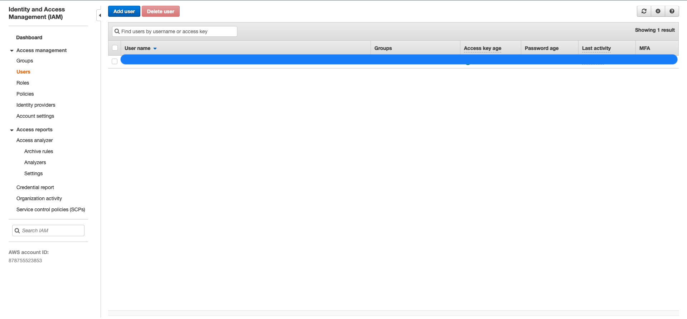
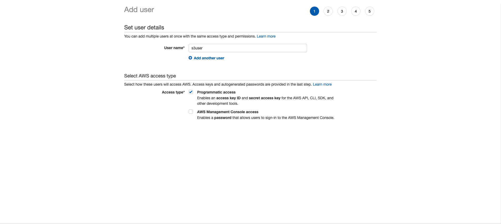
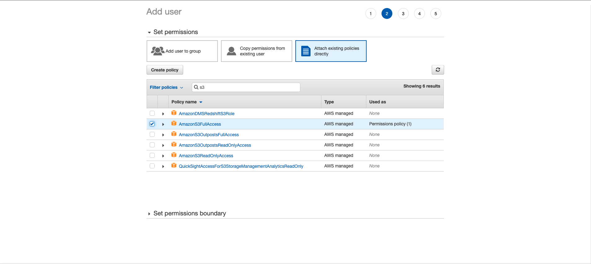
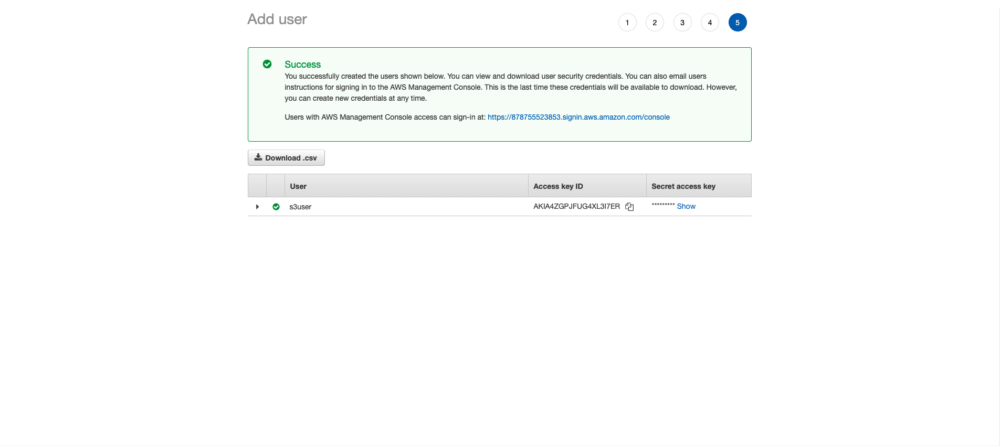
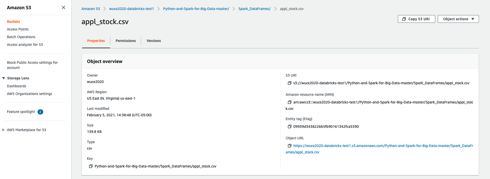

# Connect AWS S3 in python using boto3

# Introduction

In this article, it shows how to connect AWS S3 in python by using boto3 package.

# Prerequistes

MacOS

Jupyter-notebook  6.2.0

python 3.8.6

# Step 1 - Create IAM User in AWS 

AWS IAM is short for Identity and Access Management. You could set/modify groups, users, roles, or other policies in IAM. We will create a new AWS user with AWS S3 access. 

## Add new user



## Set user name


 
## Assign user S3 access

There are several options you can choose in thie step. You can set S3 full access, S3 only read, access for specific bucket, etc. Here I will choose AmazonS3FullAccess.



## Record user Access key ID and Secret access key

Copy and paste the user's Access key ID and Secret access key somewhere. It is very important. We are going to use this strings in boto3 connection configuration.



# Step 2 - Install boto3

pip install boto3 in jupyter python file

```
pip install boto3
```

# Step 3 - Set boto3 configuration 

First of all, import boto3 package

```
import boto3
```

Configurate boto3 resource. Assign the aws access key id and aws secret access key into it. Replace 'your-aws-access-key-id' and 'your-aws-secret-access-key' with the IAM user's Access key ID and Secret access key we just created.

```python
s3 = boto3.resource(
    service_name='s3',
    region_name='us-east-1',
    aws_access_key_id='your-aws-access-key-id',
    aws_secret_access_key='your-aws-secret-access-key'
)
```

# Step 4 - Read S3 file in your bucket

Print all bucket name

```python
for bucket in s3.buckets.all():
    print(bucket.name)
```

Write csv file to s3 bucket

```python
foo = pd.DataFrame({'x':[1,2,3], 'y':['a','b','c']})
foo.to_csv('foo.csv')
s3.Bucket('wuce2020-databricks-test1').upload_file(Filename='foo.csv', Key='foo.csv')
```

load test.csv from S3 to pandas df. Replace 'your-bucket' and 'your-filename' with your AWS s3 bucket name and the file key.

Note: If you don't know how to get file key, just follow the following step. 

Find your file bucket/path-to-your-file. Then you would see the file properties. In the left corner there is key as the following image shows. Copy it.



Read the file into pandas dataframe

```python
import pandas as pd

obj = s3.Bucket('your-bucket').Object('your-filename').get()
df = pd.read_csv(obj['Body'], index_col=0)
print(df.head(5))
```
